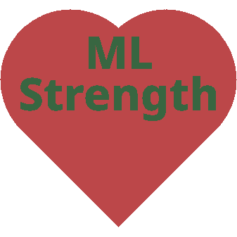

[![Contributors][contributors-shield]][contributors-url]
[![Forks][forks-shield]][forks-url]
[![Stargazers][stars-shield]][stars-url]
[![Issues][issues-shield]][issues-url]
[![LinkedIn][linkedin-shield]][linkedin-url]

<!-- PROJECT LOGO -->
 

  

<h3 align="center">ML Strength</h3>

  

    Created for a Tafe assignment. 

 
<a href="https://github.com/sirjamo1/AT3_Website_Howells_467957957"><strong>Explore the docs »</strong></a>
 
 
<a href="https://sirjamo1.github.io/AT3_Website_Howells_467957957/">View Demo</a>
·
<a href="https://github.com/sirjamo1/AT3_Website_Howells_467957957/issues">Report Bug</a>
·
<a href="https://github.com/sirjamo1/AT3_Website_Howells_467957957/issues">Request Feature</a>

  

<!-- TABLE OF CONTENTS -->

  
Table of Contents

  <ol>
    <li>
      <a href="#about-the-project">About The Project</a>
      <ul>
        <li><a href="#built-with">Built With</a></li>
      </ul>
    </li>
    <li><a href="#contact">Contact</a></li>
    <li><a href="#acknowledgments">Acknowledgments</a></li>
  </ol>

<!-- ABOUT THE PROJECT -->

## About The Project

    General Instructions:

(<a href="#readme-top">back to top</a>)

### Built With

-   HTML
-   CSS
-   JS

(<a href="#readme-top">back to top</a>)

## Usage

## Contact

James Howells - jam_how@hotmail.com

Project Link: [https://sirjamo1.github.io/AT3_Website_Howells_467957957/](https://sirjamo1.github.io/AT3_Website_Howells_467957957/)

(<a href="#readme-top">back to top</a>)

<!-- ACKNOWLEDGMENTS -->

## Acknowledgments

-   
-   
-   
-   

(<a href="#readme-top">back to top</a>)

<!-- MARKDOWN LINKS & IMAGES -->
<!-- https://www.markdownguide.org/basic-syntax/#reference-style-links -->

[contributors-shield]: https://img.shields.io/github/contributors/sirjamo1/AT3_Website_Howells_467957957.svg?style=for-the-badge
[contributors-url]: https://github.com/sirjamo1/AT3_Website_Howells_467957957/graphs/contributors
[forks-shield]: https://img.shields.io/github/forks/sirjamo1/AT3_Website_Howells_467957957.svg?style=for-the-badge
[forks-url]: https://github.com/sirjamo1/AT3_Website_Howells_467957957/network/members
[stars-shield]: https://img.shields.io/github/stars/sirjamo1/AT3_Website_Howells_467957957.svg?style=for-the-badge
[stars-url]: https://github.com/sirjamo1/AT3_Website_Howells_467957957/stargazers
[issues-shield]: https://img.shields.io/github/issues/sirjamo1/AT3_Website_Howells_467957957.svg?style=for-the-badge
[issues-url]: https://github.com/sirjamo1/AT3_Website_Howells_467957957/issues
[license-shield]: https://img.shields.io/github/license/sirjamo1/AT3_Website_Howells_467957957.svg?style=for-the-badge
[license-url]: https://github.com/sirjamo1/AT3_Website_Howells_467957957/blob/master/LICENSE.txt
[linkedin-shield]: https://img.shields.io/badge/-LinkedIn-black.svg?style=for-the-badge&logo=linkedin&colorB=555
[linkedin-url]: https://linkedin.com/in/linkedin_username
[product-screenshot]: images/screenshot.png
[next.js]: https://img.shields.io/badge/next.js-000000?style=for-the-badge&logo=nextdotjs&logoColor=white
[next-url]: https://nextjs.org/
[react.js]: https://img.shields.io/badge/React-20232A?style=for-the-badge&logo=react&logoColor=61DAFB
[react-url]: https://reactjs.org/
[vue.js]: https://img.shields.io/badge/Vue.js-35495E?style=for-the-badge&logo=vuedotjs&logoColor=4FC08D
[vue-url]: https://vuejs.org/
[angular.io]: https://img.shields.io/badge/Angular-DD0031?style=for-the-badge&logo=angular&logoColor=white
[angular-url]: https://angular.io/
[svelte.dev]: https://img.shields.io/badge/Svelte-4A4A55?style=for-the-badge&logo=svelte&logoColor=FF3E00
[svelte-url]: https://svelte.dev/
[laravel.com]: https://img.shields.io/badge/Laravel-FF2D20?style=for-the-badge&logo=laravel&logoColor=white
[laravel-url]: https://laravel.com
[bootstrap.com]: https://img.shields.io/badge/Bootstrap-563D7C?style=for-the-badge&logo=bootstrap&logoColor=white
[bootstrap-url]: https://getbootstrap.com
[jquery.com]: https://img.shields.io/badge/jQuery-0769AD?style=for-the-badge&logo=jquery&logoColor=white
[jquery-url]: https://jquery.com
